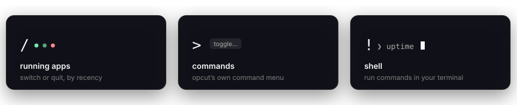

<p align="center">
  
</p>

<h1 align="center">opcut</h1>

<p align="center">
  More cuts from your <kbd>⌥ Option</kbd> key.<br/>
  A lightweight macOS tray launcher, switcher, and command bar.
</p>

<p align="center">
  
  
</p>

## One key, four prefixes

Tap <kbd>⌥</kbd>, start typing to launch — or lead with a prefix:

<p align="center">
   commands, ! shell" />
</p>

## Switch without thinking

Hold <kbd>⌥</kbd> and hit <kbd>Tab</kbd> to cycle through running apps, most recent first. Or pin favorites to <kbd>⌥1</kbd>–<kbd>⌥9</kbd> and jump straight to them. A three-finger swipe opens apps too — no keys at all.

<p align="center">
  
</p>

Works over fullscreen apps. Lives quietly in the menu bar.

## Install

Grab the latest `.app` from [Releases](https://github.com/notkearash/opcut/releases), or build it yourself:

```bash
bun install
bun run tauri build   # output in src-tauri/target/release/bundle/macos/
```

Prerequisites: [Rust](https://rustup.rs/) and [Bun](https://bun.sh/).

## Development

```bash
bun run dev
```

Starts Vite and the Tauri dev window with hot reload.

## License

See [LICENSE](LICENSE).
